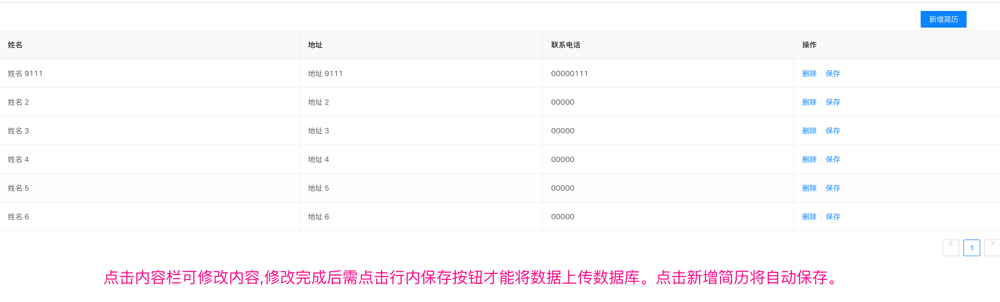

> 题目：
>
> 需求：实现登录页面（简易版即可），实现登录验证功能、登录之后跳转到列表页，查询出 tb_resume 表【表数据和课上保持一致】的所有数据（列表不要求分页，在列表右上方有“新增”按钮，每一行后面有“编辑”和“删除”按钮，并实现功能），如果未登录就访问url则跳转到登录页面，用户名和密码固定为admin/admin
>
> 技术要求：根据SSM整合的思路，进行SSS整合（Spring+SpringMVC+SpringDataJPA）,登录验证使用SpringMVC拦截器实现
>
> 【提交时统一数据库名test，用户名和密码root】

### 1.说明

登陆页面地址：http://localhost:8080/user/login

简介展示页面地址：http://localhost:8080/resume

用户名&密码：admin&admin

数据接口地址：

| 地址              | 请求方式 | 说明           |
| ----------------- | -------- | -------------- |
| /resume/queryById | GET      | 按照id查询简介 |
| /resume/queryAll  | GET      | 查询所有简介   |
| /resume/save      | POST     | 保存简介       |
| /resume/delete    | DELETE   | 删除简介       |

### 2.功能实现

 #### 2.1 在未登陆之前访问简介页面，跳转到登陆页面。

>1. 打开浏览器直接访问http://localhost:8080/下任意接口 ，直接跳转到http://localhost:8080/user/login
>
>2. 登陆时如果账号密码错误，提示错误信息
>
>
>
>3. 登陆成功后1s自动跳转到http://localhost:8080/resume页面。并且在浏览器关闭之前无需重新登陆

#### 2.2 简介页面实现

- 点击“新增简历”按钮，自动添加**并保存一条数据到数据库**。并且自动刷新页面。
- 点击内容修改了数据信息后点击行内“保存”按钮（**不点击保存之前数据不会持久化到数据库**），将数据保存至数据库，保存完成后自动刷新页面
- 点击删除按钮删除后台数据，并自动刷新页面